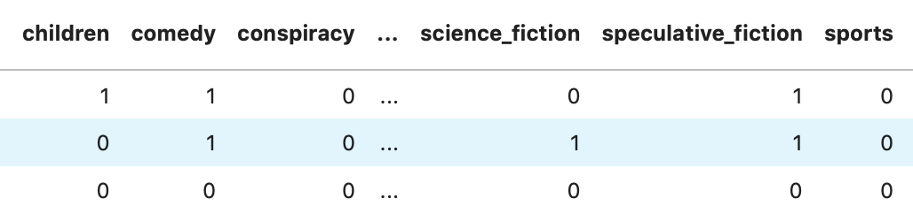

## {.section data-background-image="../resources/bigorangeClean.jpg" data-background-size="450px"}

## App Motivation & Use Case

<section data-background-image="../resources/book3.jpg" data-background-size="1000px"></section>

* Often when writing a book,\n
I get so lost in writing it,\n
I don't know what genre it fits in to\n
* Publishers may go through\n
the same problem
* Can help readers judge a book before reading

## App Demonstration

1.) Dune

 In the far future, humanity has eschewed advanced computers due to a religious prohibition, in favor of adapting their minds to be capable of extremely complex tasks. Much of this is enabled by the spice melange, which is found only on Arrakis, a desert planet with giant sandworms as its most notable native lifeform. Melange improves general health, extends life and can bestow limited prescience, and its rarity makes it a form of currency in the interstellar empire. Melange allows the Spacing Guild's Navigators to safely route faster-than-light travel between planets, and helps the Reverend Mothers of the matriarchal Bene Gesserit to access their Other Memory, the ego and experiences of their female ancestors.

  

2.) Nathan's Journey

 This thrilling story follows the escapades of the sly and silky smooth spy Agent Nate Frankonia. Nate has been trained his entire life in stealth operations, and the lucky for him (but unluckily for the World), he has never been needed more than now. Follow Nate on this intense and suspenseful journey as he infiltrates a Russian government post in order to steal the secret nuclear launch codes necessary to prevent the next world war. With the training of his Analytics Value Chain class he is able to hack into the security systems, dismantling the imminent threat of a nuclear first strike, all while getting back in true Nate Frankonia suave style for family dinner. Will this be the episode where someone uncovers his true identity, or will Nate be able to continue masquerading as a data scientist living a normal life? Read this entertaining tale of espionage to find out!

  

[Web App](http://18.217.44.84:3000)

## Data
<section data-background-image="../resources/book3.jpg" data-background-size="1000px"></section>

    **Raw Data:**  
    12500 books scraped from Wikipedia with their summaries and genres. 
  

    **Transformed Data** 
    
        
        
    
  

## Model & Success Metrics
<section data-background-image="../resources/book3.jpg" data-background-size="1000px"></section>

    **Model:**  
    Random Forest Classifier with **multilabel** output  
    (essentially fits an RFC for *every* individual genre)  
  

    **Success Metrics**  
    **Model**: F1 Score for all ~30 models  
    **Business Value**: If the user found it useful  
  

## Interesting Findings

<section data-background-image="../resources/book3.jpg" data-background-size="1000px"></section>

    
        **New topics which we didn't cover too much of:**    
        * NLP  
        * word2vec  
        * LDA  
       Genre is fuzzy, not entirely possible to confine a piece of writing to one genre, or sometimes any existing genres  
        **Genres I had Never Encountered**  
        * albino_bias  
        * chick-lit  
        * hardboiled (type of myster)  
    
 

## THANKS!

