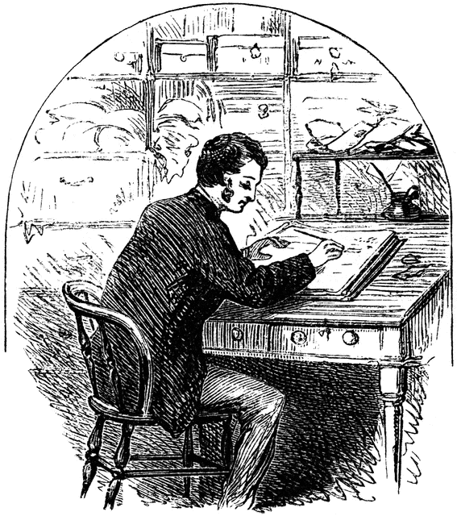

## {.section data-background-image="../resources/bigorangeClean.jpg" data-background-size="450px"}

## App Motivation & Use Case

<section data-background-image="../resources/book3.jpg" data-background-size="1000px"></section>

* Often when writing a book,\n
I get so lost in writing it,\n
I don't know what genre it fits in to\n
* Publishers may go through\n
the same problem
* Can help readers judge a book before reading

## App Demonstration

1.) Dune

 In the far future, humanity has eschewed advanced computers due to a religious prohibition, in favor of adapting their minds to be capable of extremely complex tasks. Much of this is enabled by the spice melange, which is found only on Arrakis, a desert planet with giant sandworms as its most notable native lifeform. Melange improves general health, extends life and can bestow limited prescience, and its rarity makes it a form of currency in the interstellar empire. Melange allows the Spacing Guild's Navigators to safely route faster-than-light travel between planets, and helps the Reverend Mothers of the matriarchal Bene Gesserit to access their Other Memory, the ego and experiences of their female ancestors.

  

2.) 50 Shades of Grey

 Ana goes on a date with Christian, on which he takes her in his helicopter, Charlie Tango, to his apartment. Once there, Christian insists that she sign a non-disclosure agreement forbidding her from discussing anything they do together, which Ana agrees to sign. He also mentions other paperwork, but first takes her to his playroom full of BDSM toys and gear. There, Christian informs her that the second contract will be one of dominance and submission, and there will be no romantic relationship, only a sexual one. The contract even forbids Ana from touching Christian or making eye contact with him. At this point, Christian realises that Ana is a virgin and takes her virginity without making her sign the contract. The following morning, Ana and Christian again have sex. His mother arrives moments after their sexual encounter and is surprised by the meeting, having previously thought Christian was homosexual, because he was never seen with a woman. Christian later takes Ana out to eat, and he reveals that he lost his virginity at age 15 to one of his mother's friends, Elena Lincoln, and that his previous dominant/submissive relationships failed due to incompatibility. Christian also reveals that in his first dominant/submissive relationship he was the submissive. Christian and Ana plan to meet again, and he takes Ana home, where she discovers several job offers and admits to Kate that she and Christian had sex.

  

[Web App](http://18.217.44.84:3000)

## Data
<section data-background-image="../resources/book3.jpg" data-background-size="1000px"></section>

    **Raw Data:**  
    12500 books scraped from Wikipedia with their summaries and genres. 
  

    **Transformed Data** 
    
        
        
    
  

## Model & Success Metrics
<section data-background-image="../resources/book3.jpg" data-background-size="1000px"></section>

    **Model:**  
    Random Forest Classifier with **multilabel** output  
    (essentially fits an RFC for *every* individual genre)  
  

    **Success Metrics**  
    **Model**: F1 Score for all ~30 models  
    **Business Value**: If the user found it useful  
  

## Interesting Findings

<section data-background-image="../resources/book3.jpg" data-background-size="1000px"></section>

    
        **New topics which we didn't cover too much of:**    
        * NLP  
        * word2vec  
        * LDA  
       Genre is fuzzy, not entirely possible to confine a piece of writing to one genre, or sometimes any existing genres  
        **Genres I had Never Encountered**  
        * albino_bias  
        * chick-lit  
        * hardboiled (type of myster)  
    
 

## THANKS!

